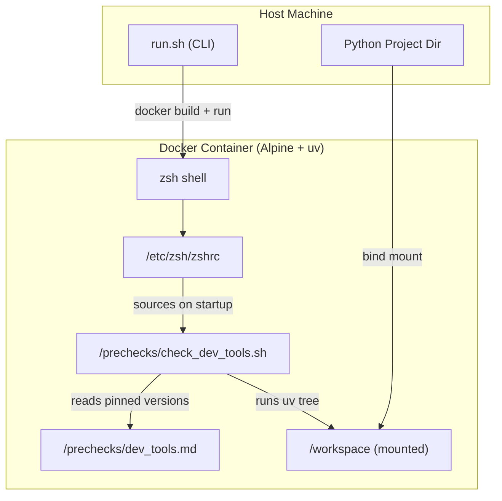
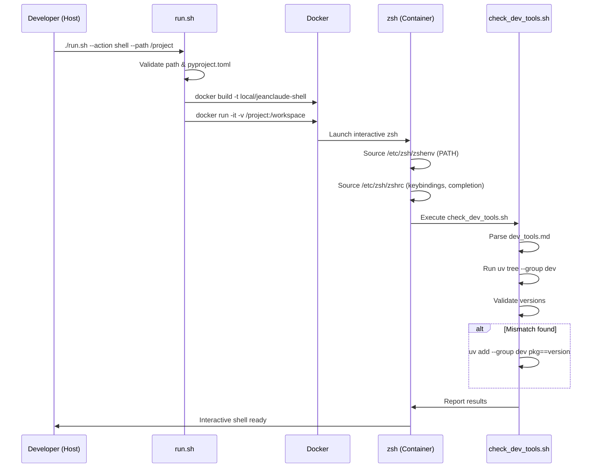

# System Patterns: jeanclaude

## Architecture Overview



## Project Structure

```
jeanclaude/
├── Dockerfile              # Container image definition
├── run.sh                  # Host-side CLI entry point
├── docs/                   # Memory Bank documentation
│   ├── projectBrief.md
│   └── systemPatterns.md
└── files/                  # Filesystem overlay (copied into container root)
    ├── etc/zsh/
    │   ├── zshenv          # PATH setup for all shell invocations
    │   └── zshrc           # Interactive shell config + precheck hook
    └── prechecks/
        ├── check_dev_tools.sh   # Dev dependency validator
        └── dev_tools.md         # Pinned version manifest
```

## Key Technical Decisions

### 1. Filesystem Overlay Pattern

The `files/` directory mirrors the container's root filesystem. `COPY files/ /` in the Dockerfile overlays custom configuration on top of the Alpine base. This keeps the Dockerfile minimal and makes it obvious where each config file ends up in the container.

### 2. Startup Hook via zshrc

`/etc/zsh/zshrc` executes `/prechecks/check_dev_tools.sh` as its last action. This ensures validation runs on every interactive shell start -- the developer cannot bypass it. This is an **eager validation / fail-fast** pattern.

### 3. Declarative Version Manifest

Dev tool versions are declared in `dev_tools.md` using `name==version` format (one per line). This is intentionally separate from any project's `pyproject.toml`, allowing jeanclaude to enforce organization-wide standards across different projects.

### 4. Self-Healing Dependencies

When `check_dev_tools.sh` detects a version mismatch, it attempts auto-correction via `uv add --group dev <package>==<version>`. This reduces friction -- developers don't have to manually fix version drift.

### 5. CLI Action Dispatch

`run.sh` uses `--action <name>` with a `case` statement for dispatch. Currently only `shell` is implemented; `publish` and `deploy` are placeholders. This pattern allows clean extensibility.

## Component Relationships

### run.sh (Host CLI)

- **Language:** Bash
- **Responsibilities:**
  - Parse CLI arguments (`--action`, `--path`)
  - Validate host-side prerequisites (directory exists, contains `pyproject.toml`, uses `uv`)
  - Build Docker image (`local/jeanclaude-shell`)
  - Launch interactive container with project mounted at `/workspace`
- **Key validation:** Checks for `[tool.uv]` section in `pyproject.toml` via grep

### Dockerfile

- **Base image:** `astral/uv:alpine`
- **Installs:** `zsh`
- **ENV:** `HOME=/workspace`, `UV_PROJECT_ENVIRONMENT=/workspace/.venv`
- **WORKDIR:** `/workspace`
- **Pattern:** Copies entire `files/` tree to `/`, overlaying system config

### check_dev_tools.sh (Container Precheck)

- **Language:** Zsh
- **Execution context:** Sourced from `/etc/zsh/zshrc` on interactive shell start
- **Flow:**
  1. Parse `dev_tools.md` into associative array (`expected_versions`)
  2. Run `uv tree --group dev` and parse output into associative array (`found_versions`)
  3. Cross-reference: flag unknown packages, flag version mismatches
  4. Auto-fix mismatches with `uv add --group dev`
  5. Report results

## Execution Flow



## Design Patterns Summary

| Pattern | Where | Purpose |
|---------|-------|---------|
| Filesystem overlay | `files/` + `COPY files/ /` | Clean config injection into container |
| Eager validation | `zshrc` -> `check_dev_tools.sh` | Fail-fast on shell startup |
| Declarative manifest | `dev_tools.md` | Version pinning separate from project config |
| Self-healing | `check_dev_tools.sh` auto-fix | Reduce developer friction |
| Action dispatch | `run.sh` case statement | Extensible CLI |
| Container-as-environment | Dockerfile + run.sh | Reproducible dev shell |
