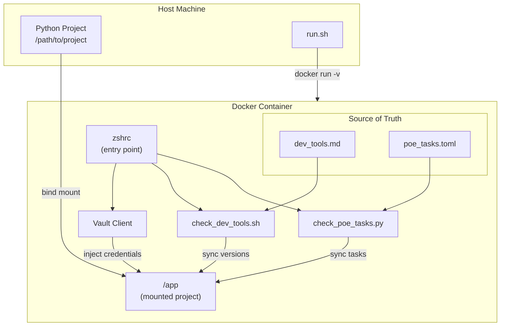

# System Patterns: JeanClaude

## Architecture Overview



## Key Technical Decisions

### 1. File Overlay Pattern
- **Decision**: Use `files/` directory structure mirroring Linux FHS
- **Rationale**: 
  - `files/etc/` - System configuration (zshrc)
  - `files/opt/` - Application scripts (prechecks)
  - `files/usr/` - Additional data (CA certificates)
- **Implementation**: `COPY files/ /` copies overlay directly to root filesystem

### 2. Startup-Time Synchronization
- **Decision**: Run sync scripts at shell initialization (via zshrc)
- **Rationale**: Ensures every interactive session starts with correct tooling
- **Trade-off**: Slight startup delay vs guaranteed consistency

### 3. Credential Injection via Vault
- **Decision**: Fetch credentials from HashiCorp Vault at startup
- **Implementation**: 
  ```bash
  vault read -format json kv/prd/gitlab | jq -r '...'
  ```
- **Exposed Variables**:
  - `UV_INDEX_PYPIMOL_GITLAB_USERNAME` - PyPI registry user
  - `UV_INDEX_PYPIMOL_GITLAB_PASSWORD` - PyPI registry password

### 4. Source-of-Truth Files

| File | Purpose | Format |
|------|---------|--------|
| `dev_tools.md` | Dev dependency versions | `package==version` (one per line) |
| `poe_tasks.toml` | Standard poe tasks | TOML `[tool.poe.tasks]` |
